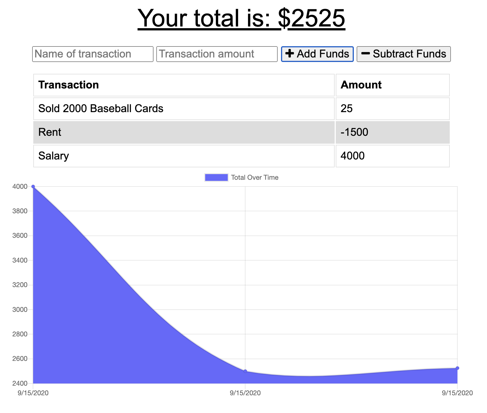

# Budget App

## Description

With this simple app the user will be able to input money received or various expenses going out to keep track of their budget. The app uses indexedDB which allows the user to input stuff offline, and once reconnected with the internet, their info will be stored in the db.

## Required downloads

express, mongoose

## Deployed Link

https://damp-scrubland-55743.herokuapp.com/

## Screengrab

